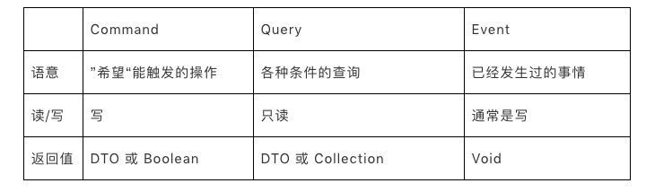

Types模块是保存可以对外暴露的Domain Primitives的地方。Domain Primitives因为是无状态的逻辑，
可以对外暴露，所以经常被包含在对外的API接口中，需要单独成为模块。Types模块不依赖任何类库，纯 POJO 。

### Command、Query、Event对象
从本质上来看，这几种对象都是Value Object，但是从语义上来看有比较大的差异：

1. Command指令：指调用方明确想让系统操作的指令，其预期是对一个系统有影响，也就是写操作。通常来讲指令需要有一个明确的返回值（如同步的操作结果，或异步的指令已经被接受）。
2. Query查询：指调用方明确想查询的东西，包括查询参数、过滤、分页等条件，其预期是对一个系统的数据完全不影响的，也就是只读操作。
3. Event事件：指一件已经发生过的既有事实，需要系统根据这个事实作出改变或者响应的，通常事件处理都会有一定的写操作。事件处理器不会有返回值。这里需要注意一下的是，Application层的Event概念和Domain层的DomainEvent是类似的概念，但不一定是同一回事，这里的Event更多是外部一种通知机制而已。

